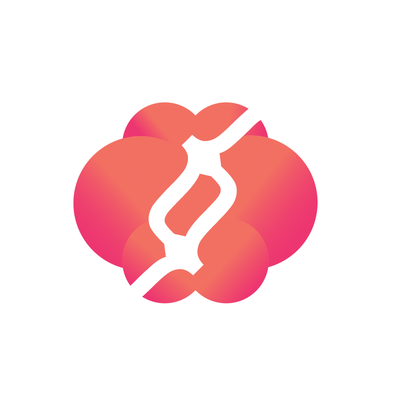
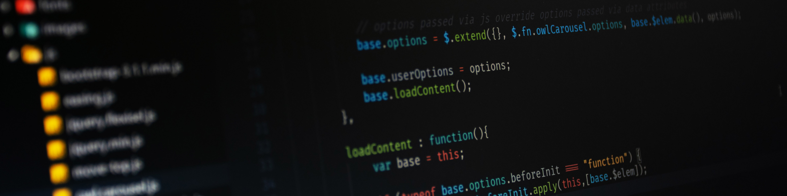

<!--  -->
<h1 style="font-size: 10vw;">🧑‍💻</h1>
<h1> Hi everyone, I'm Muhammad Rizal Wiyono 👋</h1>

 Hi, I am someone who has an enthusiasm in the field of <i>informatics engineering</i>, I like to explore the world of <i>websites</i>, precisely on the <i>Frontend</i>. I've been through a lot of twists and turns by the time I work. I also have a basic <i>UI/UX Design</i>, <i>templates design</i>, <i>flyers</i>, and more. I have the principle that everything will happen when we want to get it done.   Keep the spirit of friends ⚡ 

<h3> GitHub Stats :</h3>

  
   
  

<h3> GitHub Trophies :</h3>

  

<h3> Tech Stack :</h3>

  
                                               

<h3> My Contact :</h3>

  - <strong>Telegram : <a href="https://t.me/rizalwiyono">@rizalwiyono</a></strong> 
  - <strong>Linkedin : <a href="https://www.linkedin.com/in/muhammad-rizal-wiyono">Muhammad Rizal Wiyono</a></strong> 
  - <strong>Email : <a href="https://muhammadrizalwiyono@gmail.com">muhammadrizalwiyono@gmail.com</a></strong>

 

 <i> Happy exploring my friend! </i> 😄 

